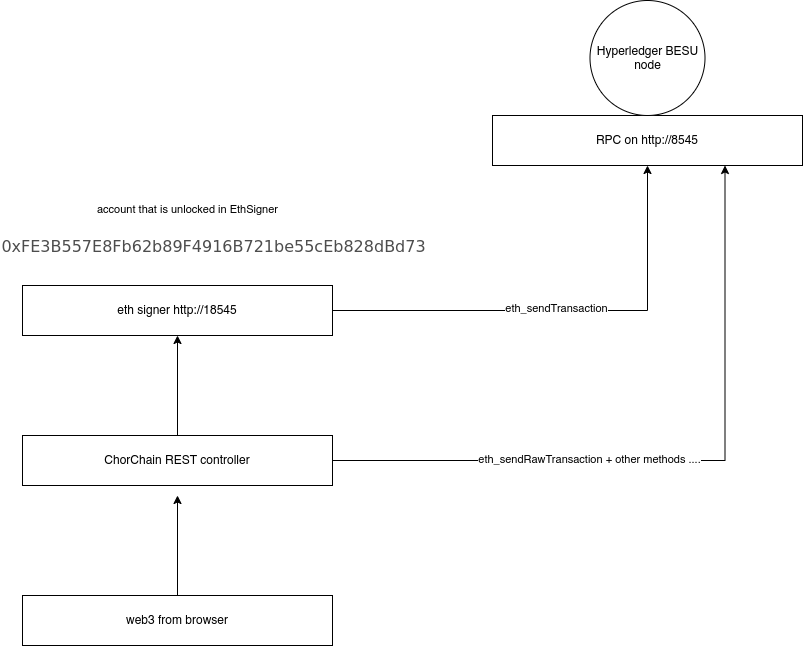

Chor Chain

Commands only for me

```
# install mongod
brew tap mongodb/brew
brew install mongodb-community@4.4
```

```
wget https://downloads.apache.org/tomcat/tomcat-9/v9.0.44/bin/apache-tomcat-9.0.44.zip
unzip apache-tomcat-9.0.44.zip

# make sure to make it executable otherwise it won't run on Intellij Premium
chmod a+x catalina.sh 
```

Download Intellij premium
create new configuration and point it to the apache tomcat 9 folder

install solidity compiler version 0.5.3

```
npm install -g solc@0.5.3
```
In the code the solc command is set to solcjs instead. (even if you set the alias sometimes it still takes the local version of solc).

Everything has been changed to 7545 rpc and events in order for the ganache chain to work


#Deploying on besu

```
npx quorum-dev-quickstart
```

This will create a bunch of Docker images, we don'y need graphana in our case

public flow

<p align="center">
  
</p>


-Requirements:

1) Apache Tomcat version 9 (connect your IDE with it to run the project on Tomcat web server)

2) MongoDB installed (recommended to install also MongoDB Compass. Graphical interface to handle all the data and allows to remove it manually)

3) An environment variable in your system 
    Variable name: ChorChain
    Value : path of the project package "C:\{path}\...\ChorChain\src\com\unicam"
  
4) The Solidity compiler in your OS (install version 0.5.3 or above from https://github.com/ethereum/solidity/releases. Probably you will have to add it in the "path" environment variable)

5) Metamask plugin in your browser with at least 1 Rinkeby account with some ether (ether available via faucets. Visit https://www.rinkeby.io/#faucet to get some.)


## Notes

```
run this to add your account to the node
web3.personal.importRawKey("8f2a55949038a9610f50fb23b5883af3b4ecb3c3bb792cbcefbd1542c692be63", "123nizarhmain")
```

thats for member1


## Practical part

Hyperledger besu:

- ✅ deploy public smart contracts
- ✅ nteract with public smart contracts (permissioned nodes)
- ✅ deploy private smart contracts
- ❌ interact with public smart contracts (eea_sendTransction, bad support on Metamask so far)

GoQuorum:

- ✅ deploy public smart contracts
- ✅ interact with public smart contracts (permissioned nodes)
- ✅ deploy private smart contracts
- ❌ interact with public smart contracts (can see current progress, but not submit, need frontend overhaul )
- ✅ can use the remix plugin though


